<p align="center">
  <picture>
    <source media="(prefers-color-scheme: dark)" srcset="frontend/src/assets/logo/wirksam-light.svg" />
    <source media="(prefers-color-scheme: light)" srcset="frontend/src/assets/logo/wirksam-dark.svg" />
    
  </picture>
</p>

<p align="center">
  <em>The volunteer scheduling platform for church events and community service.<br/>Book your shifts for Pfingsten, Kirchentag, and more — effective together.</em>
</p>

<p align="center">
  <em>WirkSam — from German "wirksam" (effective) and "zusammen" (together).<br/>Because volunteering works best when we work together.</em>
</p>

---

## Screenshots

### Dashboard

Get a bird's-eye view of your events, bookings, and an interactive calendar — all in one place.

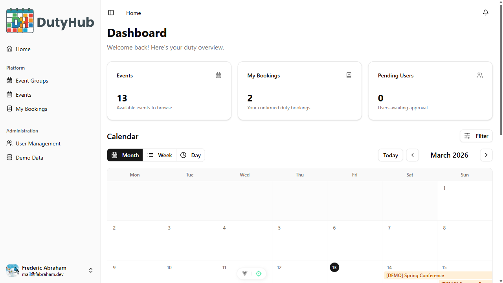

### Events & Slots

Browse all duty events with inline slot previews, search, and smart filters.

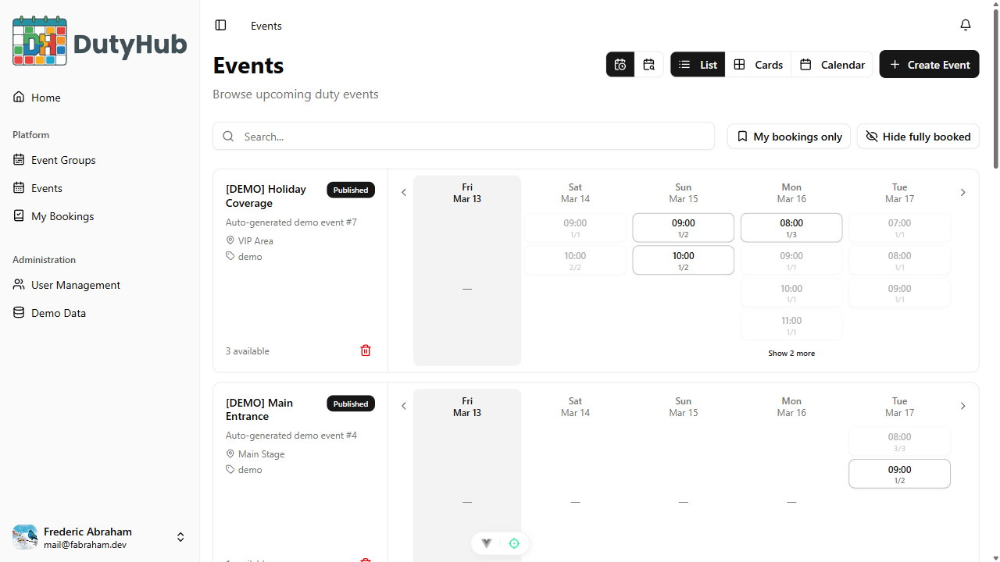

### Event Detail

See all available duty slots by day, book with one click, and track availability.

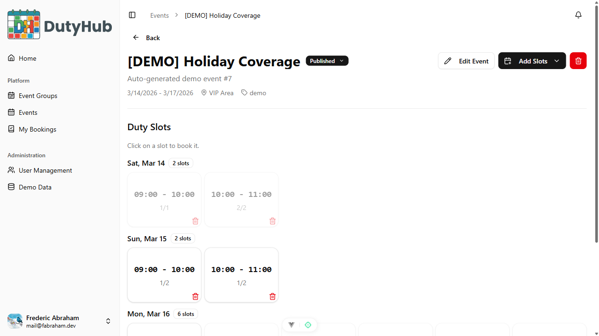

### My Bookings

All your confirmed duties in one place — filter by upcoming, this month, or view all.

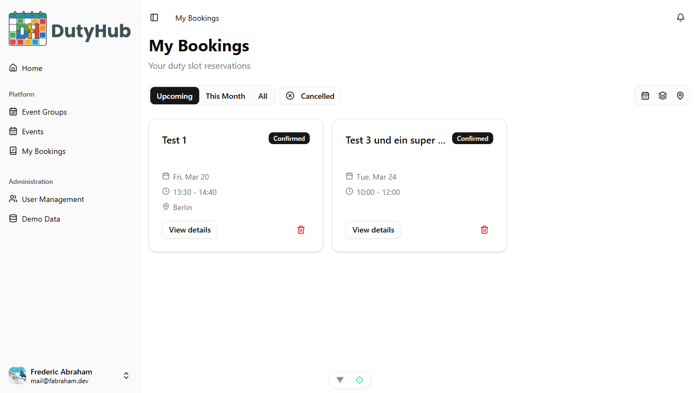

### Event Groups

Organize related events into groups like conferences or festivals for easy management.

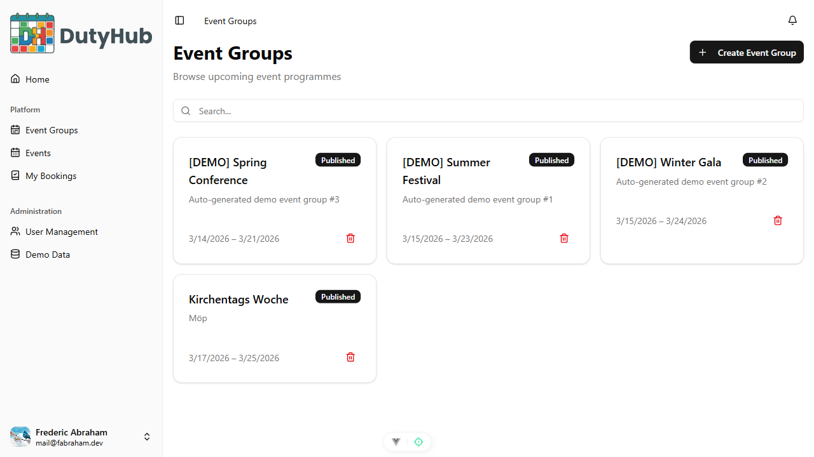

### Notifications & Preferences

Stay informed with real-time notifications and fine-tune delivery via email, push, or Telegram.

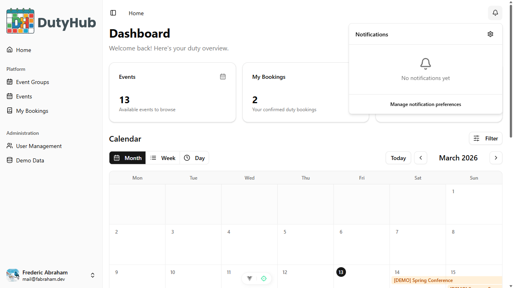
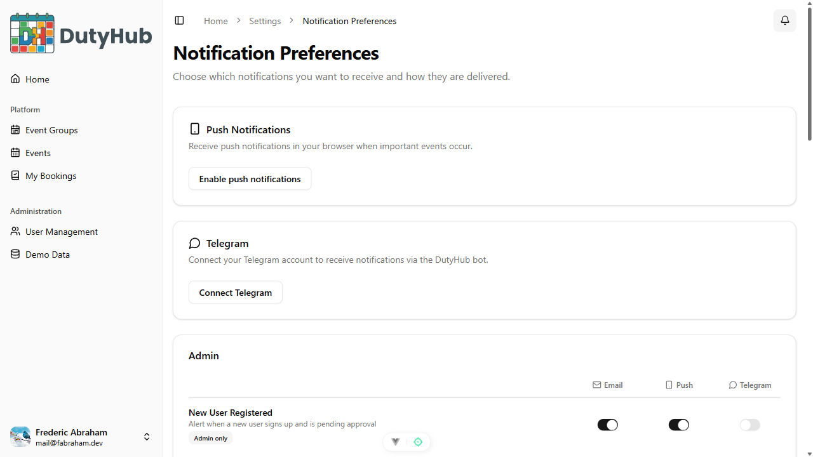

### User Management

Admins can manage users, roles, and approval workflows from a central dashboard.

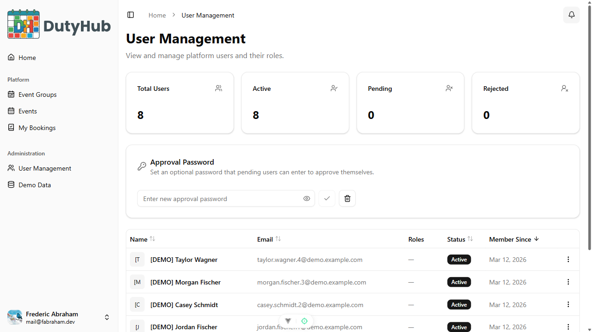

### Event Creation Wizard

Create events step-by-step: details, dates, schedule configuration, and a live slot preview.

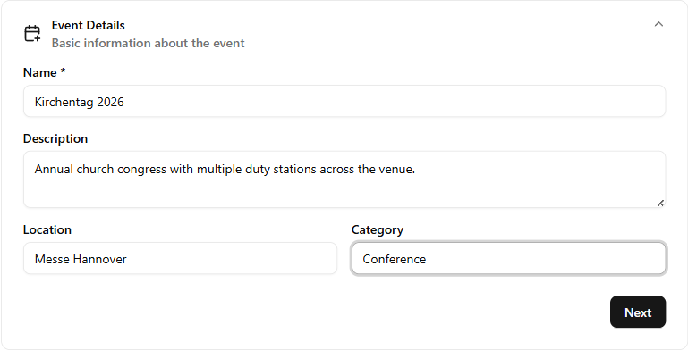
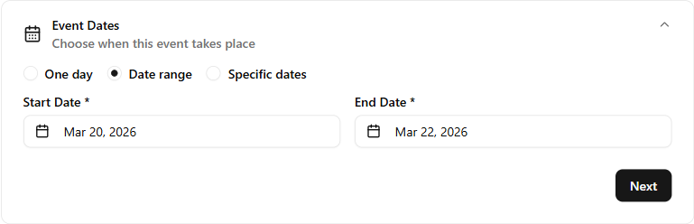
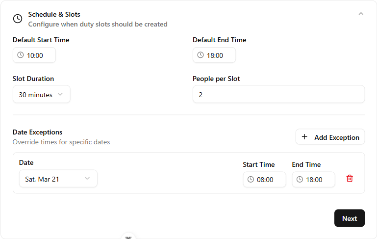
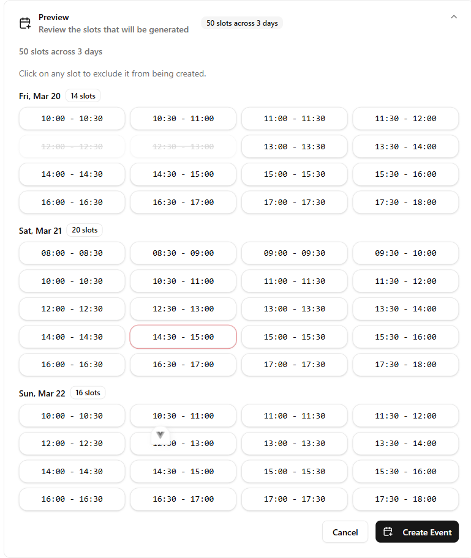

---

## Technology Stack

- **Backend:** [FastAPI](https://fastapi.tiangolo.com) + [SQLModel](https://sqlmodel.tiangolo.com) (async SQLAlchemy) + [PostgreSQL](https://www.postgresql.org) + [Alembic](https://alembic.sqlalchemy.org/) migrations + [Auth0](https://auth0.com) JWT authentication
- **Frontend:** [Vue 3](https://vuejs.org) + TypeScript + [Vite](https://vite.dev) + [Pinia](https://pinia.vuejs.org) + [Vue Router](https://router.vuejs.org) + [Tailwind CSS v4](https://tailwindcss.com) + [shadcn-vue](https://www.shadcn-vue.com/) + [Vue I18n](https://vue-i18n.intlify.dev) (EN/DE)
- **Testing:** [Pytest](https://pytest.org) (backend) + [Playwright](https://playwright.dev) (E2E)
- **Infra:** [Docker Compose](https://www.docker.com) + [Traefik](https://traefik.io) reverse proxy + GitHub Actions CI/CD
- **DX:** Auto-generated TypeScript API client via `@hey-api/openapi-ts`, [Zod](https://zod.dev) + [Vee-Validate](https://vee-validate.logaretm.com) forms, Ruff + basedpyright + ESLint linting

## How To Use It

You can **just fork or clone** this repository and use it as is.

### How to Use a Private Repository

If you want to have a private repository, GitHub won't allow you to simply fork it as it doesn't allow changing the visibility of forks.

But you can do the following:

- Create a new GitHub repo, for example `my-full-stack`.
- Clone this repository manually, set the name with the name of the project you want to use, for example `my-full-stack`:

```bash
git clone git@github.com:Blaxzter/fastapi-vue-fullstack-template.git my-full-stack
```

- Enter into the new directory:

```bash
cd my-full-stack
```

- Set the new origin to your new repository, copy it from the GitHub interface, for example:

```bash
git remote set-url origin git@github.com:octocat/my-full-stack.git
```

- Add this repo as another "remote" to allow you to get updates later:

```bash
git remote add upstream git@github.com:Blaxzter/fastapi-vue-fullstack-template.git
```

- Push the code to your new repository:

```bash
git push -u origin main
```

### Update From the Original Template

After cloning the repository, and after doing changes, you might want to get the latest changes from this original template.

- Make sure you added the original repository as a remote, you can check it with:

```bash
git remote -v

origin    git@github.com:octocat/my-full-stack.git (fetch)
origin    git@github.com:octocat/my-full-stack.git (push)
upstream    git@github.com:Blaxzter/fastapi-vue-fullstack-template.git (fetch)
upstream    git@github.com:Blaxzter/fastapi-vue-fullstack-template.git (push)
```

- Pull the latest changes without merging:

```bash
git pull --no-commit upstream master
```

This will download the latest changes from this template without committing them, that way you can check everything is right before committing.

- If there are conflicts, solve them in your editor.

- Once you are done, commit the changes:

```bash
git merge --continue
```

### Clean Up the Template

After cloning, remove sample content you don't need:

```bash
# Remove example/demo pages only
just remove-examples

# Remove the project/task sample domain (models, CRUD, routes, views, migrations, tests)
just remove-domain

# Or do both at once and regenerate the API client
just clean-template
```

After cleanup you'll have a clean foundation with auth, user management, health endpoints, base CRUD infrastructure, and all UI components ready for your own features. See [AGENTS.md](./AGENTS.md#template-cleanup) for details on what each step removes and what remains.

### Generate Secret Keys

Some environment variables in the `.env` file have a default value of `changethis`.

You have to change them with a secret key, to generate secret keys you can run the following command:

```bash
python -c "import secrets; print(secrets.token_urlsafe(32))"
```

Copy the content and use that as password / secret key. And run that again to generate another secure key.

## How To Use It - Alternative With Copier

This repository also supports generating a new project using [Copier](https://copier.readthedocs.io).

It will copy all the files, ask you configuration questions, and update the `.env` files with your answers.

### Install Copier

You can install Copier with:

```bash
pip install copier
```

Or better, if you have [`pipx`](https://pipx.pypa.io/), you can run it with:

```bash
pipx install copier
```

**Note**: If you have `pipx`, installing copier is optional, you could run it directly.

### Generate a Project With Copier

Decide a name for your new project's directory, you will use it below. For example, `my-awesome-project`.

Go to the directory that will be the parent of your project, and run the command with your project's name:

```bash
copier copy https://github.com/Blaxzter/fastapi-vue-fullstack-template.git my-awesome-project --trust
```

If you have `pipx` and you didn't install `copier`, you can run it directly:

```bash
pipx run copier copy https://github.com/Blaxzter/fastapi-vue-fullstack-template.git my-awesome-project --trust
```

**Note** the `--trust` option is necessary to be able to execute a [post-creation script](https://github.com/Blaxzter/fastapi-vue-fullstack-template.git/blob/master/.copier/update_dotenv.py) that updates your `.env` files.

### Input Variables

Copier will ask you for some data, you might want to have at hand before generating the project.

But don't worry, you can just update any of that in the `.env` files afterwards.

The input variables, with their default values (some auto generated) are:

- `project_name`: (default: `"FastAPI Project"`) The name of the project, shown to API users (in .env).
- `stack_name`: (default: `"fastapi-project"`) The name of the stack used for Docker Compose labels and project name (no spaces, no periods) (in .env).
- `smtp_host`: (default: "") The SMTP server host to send emails, you can set it later in .env.
- `smtp_user`: (default: "") The SMTP server user to send emails, you can set it later in .env.
- `smtp_password`: (default: "") The SMTP server password to send emails, you can set it later in .env.
- `emails_from_email`: (default: `"info@example.com"`) The email account to send emails from, you can set it later in .env.
- `postgres_password`: (default: `"changethis"`) The password for the PostgreSQL database, stored in .env, you can generate one with the method above.
- `sentry_dsn`: (default: "") The DSN for Sentry, if you are using it, you can set it later in .env.

## Backend Development

Backend docs: [backend/README.md](./backend/README.md).

## Frontend Development

Frontend docs: [frontend/README.md](./frontend/README.md).

## Deployment

Deployment docs: [deployment.md](./deployment.md).

## Development

General development docs: [development.md](./development.md).

This includes using Docker Compose, custom local domains, `.env` configurations, etc.

## Release Notes

Check the file [release-notes.md](./release-notes.md).

## License

WirkSam is licensed under the [MIT License](./LICENSE). You're free to use, modify, and distribute it — just keep the copyright notice.
